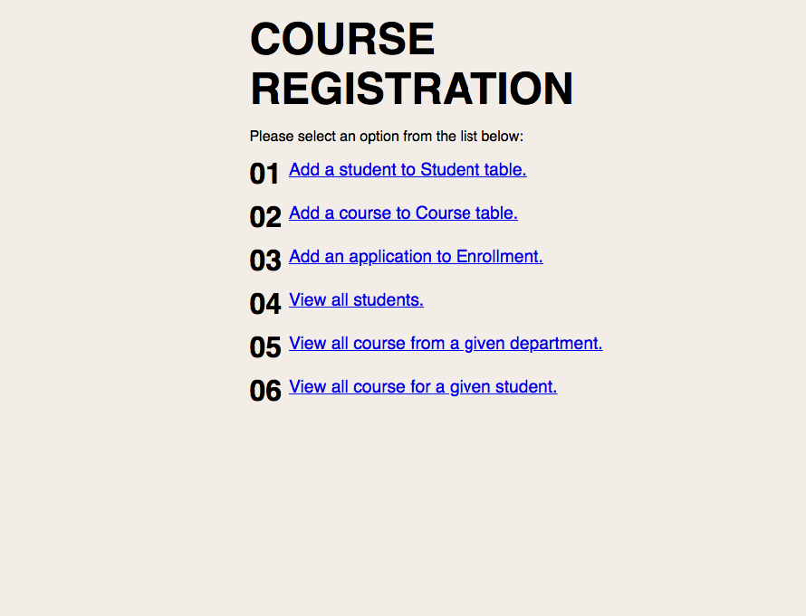

# Final project for Database Management Systems, Spring 2020

A student/course registration site for demonstrating SQL and database knowledge:

http://turing.csce.uark.edu/~jostermu/d-b-final/project_java/index.html




##SQL Schema:
```
CREATE TABLE Student (
    StudentId INT,
    StudentName CHAR(50) NOT NULL,
    Major CHAR(50) NOT NULL,
    PRIMARY KEY (StudentId)
);

CREATE TABLE Course (
    CourseId INT NOT NULL AUTO_INCREMENT,
    CourseNum INT NOT NULL,
    DeptCode INT NOT NULL,
    Title CHAR(50) NOT NULL,
    CreditHours INT NOT NULL,
    PRIMARY KEY (CourseId)
);

CREATE TABLE Enrollment (
    EnrollmentId INT NOT NULL AUTO_INCREMENT,
    StudentId INT NOT NULL FOREIGN KEY REFERENCES Student(StudentId),
    DeptCode INT NOT NULL FOREIGN KEY REFERENCES Course(DeptCode),
    CourseNum INT NOT NULL FOREIGN KEY REFERENCES Course(CourseNum),
    PRIMARY KEY (EnrollmentId)
);
```

## **Note: project is DEPRECIATED. Domain is still up but database is no longer connected.**
